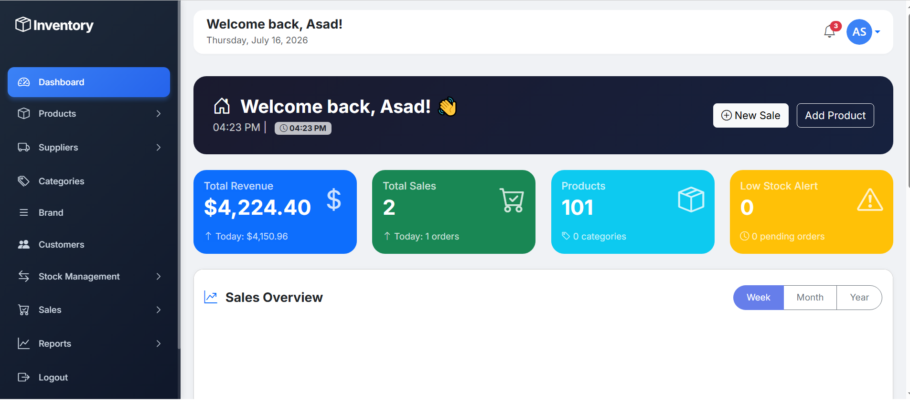
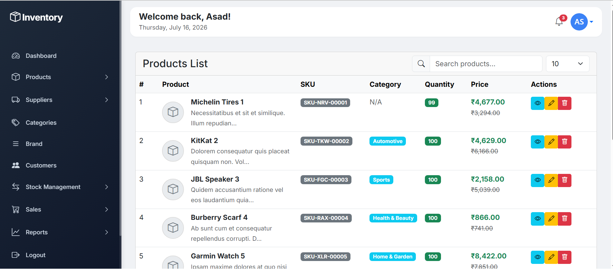
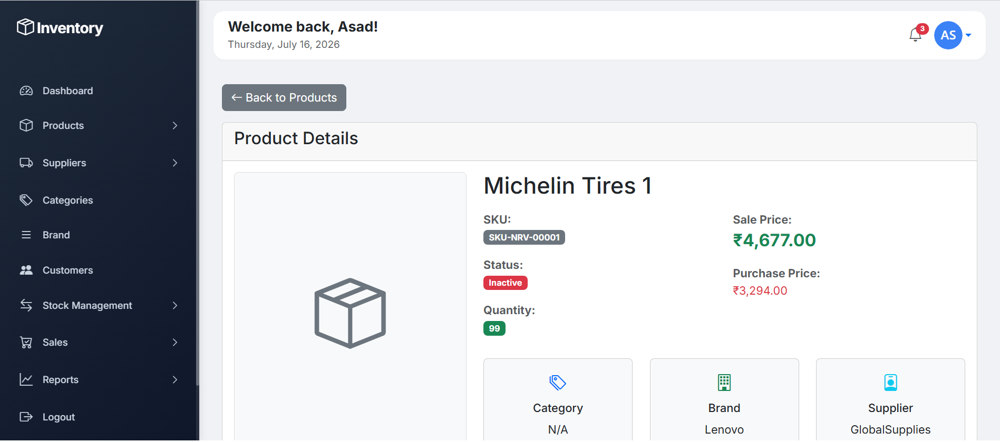
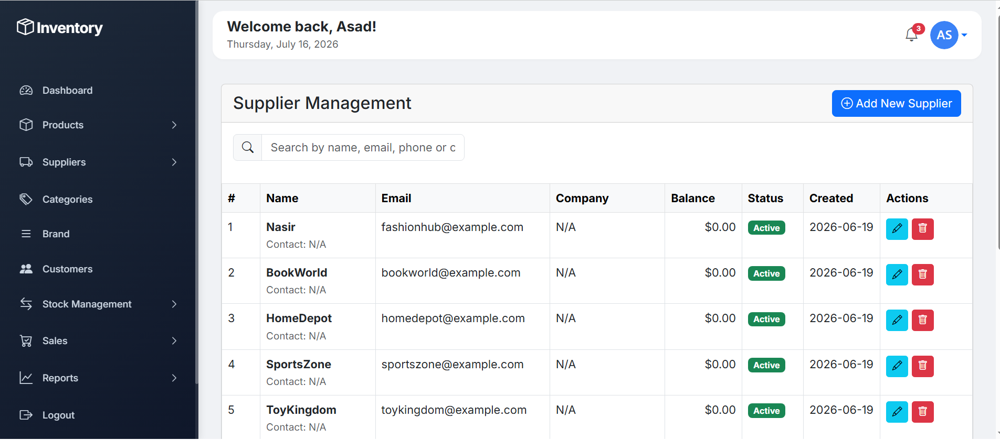
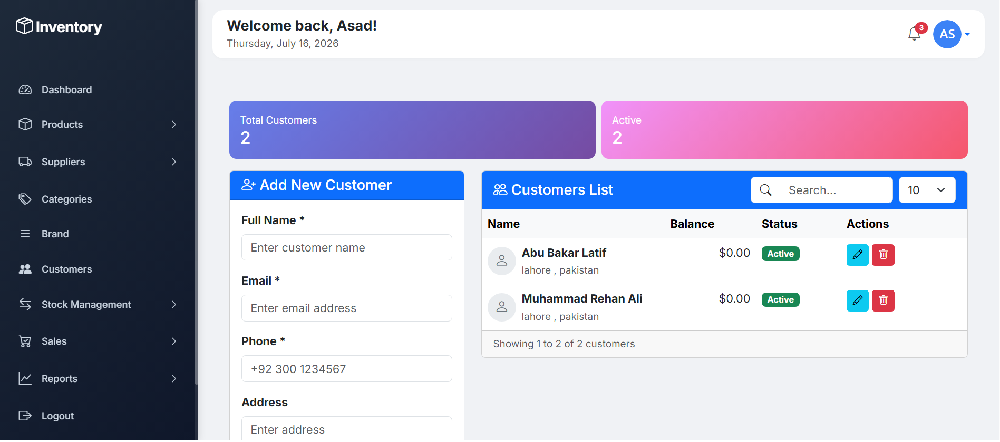
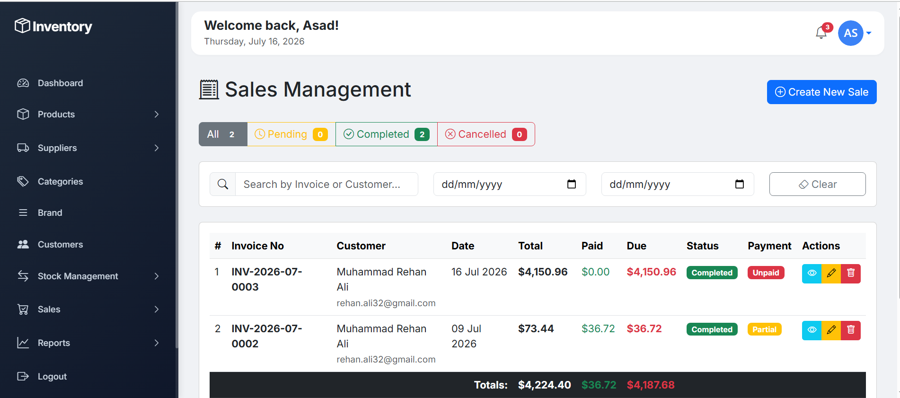
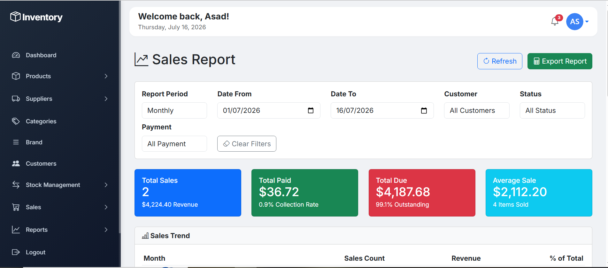

# 📦 Inventory Management System

<p align="center">


</p>

A modern **Full-Stack Inventory Management System** built with **Laravel, Livewire, Bootstrap 5, and MySQL**. The application provides businesses with an efficient solution to manage inventory, products, suppliers, customers, stock movements, sales, invoices, and business reports from a single dashboard.

Designed using modern Laravel architecture, real-time Livewire components, responsive UI, and scalable database relationships.

---

# 🚀 Live Features

- 🔐 Authentication System
- 📊 Interactive Dashboard
- 📦 Product Management
- 🏷 Category Management
- 🏢 Brand Management
- 🚚 Supplier Management
- 👥 Customer Management
- 📦 Inventory Tracking
- 📈 Stock Management
- 💰 Sales Management
- 🧾 Invoice Generation
- 📊 Sales Reports
- 📉 Stock Reports
- 📑 Supplier Reports
- 🔎 Live Search
- 📄 Pagination
- 📱 Responsive Design

---

# 📸 Screenshots

## Dashboard



---

## Products



---

## Product Details



---

## Suppliers



---

## Customers



---

## Sales



---

## Invoice


---

## Reports



---

# ✨ Dashboard

The dashboard provides a complete business overview including:

- Total Revenue
- Total Sales
- Total Products
- Low Stock Alerts
- Weekly Sales Analytics
- Monthly Sales Analytics
- Yearly Sales Analytics
- Quick Navigation
- Real-time Statistics

---

# 📦 Product Management

Manage complete product lifecycle.

### Features

- Create Product
- Update Product
- Delete Product
- Product Details
- Search Products
- Pagination
- Product Images
- SKU Management
- Purchase Price
- Selling Price
- Product Status
- Supplier Association
- Category Association
- Brand Association

---

# 🏷 Category Management

- Create Categories
- Update Categories
- Delete Categories
- Status Management
- Category Listing

---

# 🏢 Brand Management

- Brand CRUD
- Image Upload
- Description
- Status
- Product Association

---

# 🚚 Supplier Management

Complete supplier management module.

### Features

- Supplier CRUD
- Company Details
- Email
- Phone
- Address
- Balance Tracking
- Active / Inactive Status
- Search Suppliers

---

# 👥 Customer Management

### Features

- Customer CRUD
- Contact Information
- Address
- Customer Balance
- Purchase History
- Search Customers

---

# 📦 Stock Management

Monitor inventory in real-time.

### Features

- Current Stock
- Stock History
- Inventory Value
- Low Stock Detection
- Out of Stock Detection
- Stock Status Filters
- Product Search
- SKU Search
- Automatic Stock Updates

---

# 💰 Sales Management

Powerful sales module for daily business operations.

### Features

- Create Sales
- Edit Sales
- Sales History
- Sales Details
- Invoice Generation
- Customer Selection
- Multiple Products
- Quantity Management
- Discount Calculation
- Tax Calculation
- Grand Total
- Payment Tracking
- Payment Methods
- Paid
- Partial Paid
- Unpaid Status

---

# 🧾 Invoice System

Automatically generates professional invoices.

Features include:

- Invoice Number
- Customer Information
- Products List
- Quantity
- Price
- Discount
- Tax
- Total
- Payment Status
- Printable Invoice

---

# 📊 Reports

## Sales Reports

- Revenue Analytics
- Date Filters
- Customer Filters
- Payment Filters
- Top Customers
- Top Products
- Sales Trend
- Revenue Summary

---

## Stock Reports

- Current Inventory
- Inventory Value
- Low Stock Products
- Out of Stock Products
- Product Summary

---

## Supplier Reports

- Supplier Summary
- Active Suppliers
- Products Supplied
- Supplier Performance

---

# ⚡ Key Features

✅ Laravel Authentication

✅ Livewire Components

✅ Real-Time Search

✅ CRUD Operations

✅ Dashboard Analytics

✅ Invoice Generation

✅ Stock Alerts

✅ Payment Tracking

✅ Reports

✅ Responsive Design

✅ Clean UI

✅ Bootstrap 5

✅ MySQL Database

---

# 🛠 Technology Stack

| Technology | Description |
|------------|-------------|
| Laravel | Backend Framework |
| Livewire | Dynamic Components |
| PHP | Server-side Language |
| Bootstrap 5 | Frontend Framework |
| Blade | Templating Engine |
| MySQL | Database |
| JavaScript | Frontend Interactions |
| FontAwesome | Icons |

---

# 📂 Project Structure

```
Inventory Management

├── Authentication

├── Dashboard

├── Products

├── Categories

├── Brands

├── Customers

├── Suppliers

├── Stock Management

├── Sales

├── Reports

└── Settings
```

---

# 🗄 Database Tables

```
users

products

categories

brands

customers

suppliers

sales

sale_items

stock_history

settings
```

---

# ⚙ Installation

## Clone Repository

```bash
git clone https://github.com/yourusername/inventory-management-system.git
```

Move into project

```bash
cd inventory-management-system
```

Install Dependencies

```bash
composer install
```

Install Node Packages

```bash
npm install
```

Create Environment File

```bash
cp .env.example .env
```

Generate Application Key

```bash
php artisan key:generate
```

Configure Database

Update your **.env**

```env
DB_DATABASE=inventory
DB_USERNAME=root
DB_PASSWORD=
```

Run Migrations

```bash
php artisan migrate --seed
```

Create Storage Link

```bash
php artisan storage:link
```

Compile Assets

```bash
npm run dev
```

Start Development Server

```bash
php artisan serve
```

---

# 🔒 Authentication

The application includes Laravel Authentication.

- Login
- Logout
- Password Encryption
- Session Protection
- Route Protection

---

# 📈 Performance

- Livewire Components
- Optimized Queries
- Lazy Loading
- Pagination
- Reusable Components
- Clean MVC Architecture

---

# 🌟 Future Improvements

- Barcode Scanner
- QR Code Support
- Purchase Orders
- Expense Module
- Warehouse Management
- Multi Store Support
- User Roles & Permissions
- REST API
- PDF Export
- Excel Export
- Email Notifications
- SMS Notifications

---

# 👨‍💻 Developer

## Muhammad Asad

**Full Stack Web & Mobile Application Developer**

### Skills

- Laravel
- Livewire
- React.js
- Node.js
- Express.js
- MongoDB
- MySQL
- Bootstrap
- Tailwind CSS
- REST APIs

---

# ⭐ Why This Project?

This project demonstrates real-world business workflows including inventory management, sales processing, invoice generation, reporting, customer management, supplier management, and stock monitoring.

It showcases strong knowledge of Laravel architecture, database design, Livewire components, CRUD operations, authentication, reporting systems, and responsive UI development.

---

# 📄 License

This project is licensed under the MIT License.

---

# ❤️ Support

If you like this project, don't forget to ⭐ Star this repository.
